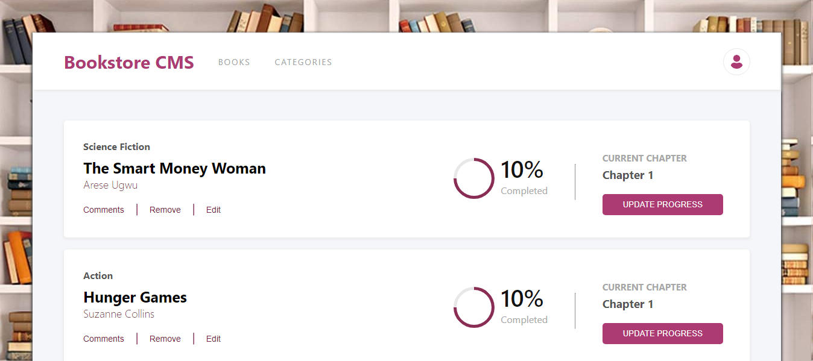

# THE-HAVEN-BOOKSTORE

> A website with two subpages "Books" and "Categories" that displays a list of books, adds a book and removes a selected book. However, i implemented only the "Books" part. The "Categories" page is empty in this MVP but leades you to a different page.

## Overview

## Screenshot



## Live Demo

[Netlify](https://the-haven-bookstore.netlify.app/)

## Built With

- Create React App (CRA)
- React Router
- Gitflow
- Hooks
- API's
- Redux
- Redux Thunk

## Getting Started

### Clone this repository

```bash
$ git clone git@github.com:Favourezeugwa/The-haven-bookstore.git
$ cd The-haven-bookstore
```

### Run project

```bash
$ npm install
$ npm start
```

### Open page in browser

```bash
$ http://localhost:3001/
```

## Author

👤 **Favour Amarachi Ezeugwa**

- GitHub: [@Favourezeugwa](https://github.com/Favourezeugwa)
- LinkedIn: [Favour Amarachi Ezeugwa](https://www.linkedin.com/in/favour-amarachi-ezeugwa-a5bb31149/)
- Twitter:[@Favour_ezeugwa](https://twitter.com/Favour_ezeugwa)

## 🤝 Contributing

Contributions, issues, and feature requests are welcome!
Feel free to check the [issues page](https://github.com/Favourezeugwa/The-haven-bookstore/issues)

## Show your support

Give a ⭐️ if you like this project!

## Acknowledgments

- Inspiration(Zeplin design used to create the UI)
- Microverse student community

## 📝 License

This project is [MIT](./MIT.md) licensed.
